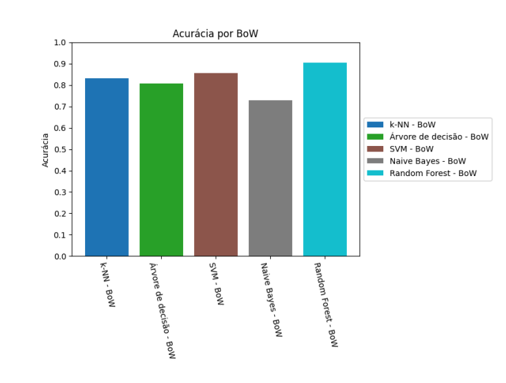

# Sentiment Analysis with Multiclasses Classification Algorithms
 

<<<<<<< HEAD
## Technologies and dependencies
<strong><a href="https://www.python.org" style="text-decoration: none; background-color: #3776AB; color: white; padding: 5px 10px; border-radius: 12px; font-family: Arial, sans-serif;">Python</a>
<a href="https://pandas.pydata.org" style="text-decoration: none; background-color: #150458; color: white; padding: 5px 10px; border-radius: 12px; font-family: Arial, sans-serif;">Pandas</a>
<a href="https://scikit-learn.org" style="text-decoration: none; background-color: #F7931E; color: white; padding: 5px 10px; border-radius: 12px; font-family: Arial, sans-serif;">Scikit-learn</a>
<a href="https://pypi.org/project/re/" style="text-decoration: none; background-color: #4B0082; color: white; padding: 5px 10px; border-radius: 12px; font-family: Arial, sans-serif;">re</a>
<a href="https://www.nltk.org" style="text-decoration: none; background-color: #FF6347; color: white; padding: 5px 10px; border-radius: 12px; font-family: Arial, sans-serif;">nltk</a>
<a href="https://matplotlib.org" style="text-decoration: none; background-color: #008CBA; color: white; padding: 5px 10px; border-radius: 12px; font-family: Arial, sans-serif;">matplotlib</a></strong>

The main language used in this project was <strong><i>Python</i></strong>, and the libraries used were

<ul>
  <li>
  Pandas</li>
  <li>
  Scikit-learn</li>
  <li>
  Matplotlib</li>
  <li>
  re</li>
  <li>
  nltk</li>
</ul>

## Introduction

In this project, various multi-class classification algorithms are implemented to determine the most effective model for sentiment analysis of social media texts. The goal is not only to identify the best algorithm but also to better understand how different text vectorization techniques impact model performance.

=======
## Introduction

In the context of Machine Learning, the classification task can be approached in several ways, each with its own advantages and disadvantages. In this project, we will implement a variety of multi-class classification algorithms to identify the most effective model for analyzing sentiment in texts from social networks.

By the end of this project, we hope to not only identify the best classification model, but also gain a deeper understanding of how different text vectorization techniques and machine learning algorithms interact and influence the accuracy of sentiment analysis.

>>>>>>> e0872833009d1853291e5aa5a1f5a29850eafe3d

## Dataset

The dataset consists of data lines obtained from social networks. They contain information such as the main content, the described sentiment, and the obtained text. Four types of sentiment are characterized in it: Positive, Negative, Neutral, and Irrelevant. The dataset contains all the information in English. Below is an example of the lines in this dataset.

 

<<<<<<< HEAD
  

## Data Analysis

The dataset initially needs some treatment. More specifically, empty rows and elements with a type other than 𝑠𝑡𝑟. Using the <strong><i>pandas</i></strong> library, 858 rows with null elements were identified and removed. In addition, 17 rows with content whose type was different from 𝑠𝑡𝑟 were removed.

Using the <strong><i>matplotlib</i></strong> library we can observe the balance of our data:

  

## Data Pre-processing

Since we are working with texts, this step is crucial. In it, we will remove any and all unnecessary information for our project. We will remove accents, punctuation, special characters and standardize our texts to lowercase. In addition, we will perform some processes such as tokenization, removal of stop words, stemming and lemmatization. Only after having done all this will we be able to continue with the project. For this, we used the <strong><i>re</i></strong> and <strong><i>ntlk</i></strong> libraries.

## Methodology

Algorithms such as <strong><i>K-Nearest Neighbors (KNN)</i></strong>, <strong><i>Decision Tree</i></strong>, <strong><i>Support Vector Machine (SVM)</i></strong>, <strong><i>Naive Bayes</i></strong>, and <strong><i>Random Forest</i></strong> were used. All the algorithms used belong to the <strong><i>sklearn</i></strong> library. Additionally, this project explored two popular text vectorization techniques: <strong><i>TF-IDF</i></strong> (Term Frequency-Inverse Document Frequency) and <strong><i>Bag of Words (BoW)</i></strong>. The combination of these techniques with different classification algorithms allowed for a comprehensive evaluation of their effectiveness in the task of sentiment analysis. With a balanced and large dataset, <strong><i>accuracy</i></strong> was used as the main performance metric for the models. Libraries such as <strong><i>numpy</i></strong> and <strong><i>matplotlib</i></strong> were used for visualizing the results. With this, the algorithms were implemented and the cross-analysis with the two types of vectorization was performed. See an example below:

  

 
=======
  

## Data Analysis

The dataset initially needs some treatment. More specifically, empty rows and elements with a type other than 𝑠𝑡𝑟. Using the 𝑝𝑎𝑛𝑑𝑎𝑠 library, 858 rows with null elements were identified   and removed. In addition, 17 rows with content whose type was different from 𝑠𝑡𝑟 were removed.

Using the 𝑚𝑎𝑡𝑝𝑙𝑜𝑡𝑙𝑖𝑏 library we can observe the balance of our data:

  

## Data Pre-processing

Since we are working with texts, this step is crucial. In it, we will remove any and all unnecessary information for our project. We will remove accents, punctuation, special characters and standardize our texts to lowercase. In addition, we will perform some processes such as tokenization, removal of stop words, stemming and lemmatization. Only after having done all this will we be able to continue with the project.

The <strong><em>re</em></strong> and <strong><em>ntlk</em></strong> libraries were used

## Methodology

Algorithms such as K-Nearest Neighbors (KNN), Decision Tree, Support Vector Machine (SVM), Naive Bayes, and Random Forest were used. All the algorithms used belong to the 𝑠𝑘𝑙𝑒𝑎𝑟𝑛 library. Additionally, this project explored two popular text vectorization techniques: TF-IDF (Term Frequency-Inverse Document Frequency) and Bag of Words (BoW). The combination of these techniques with different classification algorithms allowed for a comprehensive evaluation of their effectiveness in the task of sentiment analysis. With a balanced and large dataset, 𝑎𝑐𝑐𝑢𝑟𝑎𝑐𝑦 was used as the main performance metric for the models. Libraries such as 𝑛𝑢𝑚𝑝𝑦 and 𝑚𝑎𝑡𝑝𝑙𝑜𝑡𝑙𝑖𝑏 were used for visualizing the results.
With this, the algorithms were implemented and the cross-analysis with the two types of vectorization was performed. See an example below:

  

>>>>>>> e0872833009d1853291e5aa5a1f5a29850eafe3d

## Results

After defining, training and predicting each model, we obtain the following results:

<<<<<<< HEAD
  

Below we can visualize these results graphically:

  

 

The three models with the best accuracy were:

  <strong>
    <i>
    <h3>KNN + TFIDF</h3>
    <h3>KNN + TFIDF</h3>
    <h3>SVM + TFIDF</h3>
    </i>
  </strong>

 
<h3>Perfomance of models with TF-IDF vectorization</h3>

  

The best one were <i><strong>KNN</strong>, <strong>SVM</strong></i> and <i><strong>Random Forest</strong></i>.

 
<h3>Perfomance of models with BoW vectorization</h3>

  

The best one were also <i><strong>KNN</strong>, <strong>SVM</strong></i> and <i><strong>Random Forest</strong></i>.

 

Below we can see the perfomance of each algorithm with each vectorization:

  

<strong>TF-IDF</strong> was superior in most models. Furthermore, the biggest difference between the two types can be observed in <strong><i>KNN</i></strong>, while the other algorithms the difference is minimal.

 

Overall, the average accuracy of all algorithms, only <strong><i>TF-IDF</i></strong>, only <strong><i>BoW</i></strong> was very similar

  

 
<h3>Average accuracy for each model:</h3>

  

 
<h1>Conclusion</h1>

The best performing models were <strong><i>KNN</i></strong>, <strong><i>SVM</i></strong>, and <strong><i>Random Forest</i></strong>, with <strong><i>Random Forest</i></strong> showing the highest stability and generalization ability. <strong><i>TF-IDF</i></strong> vectorization outperformed <strong><i>Bag of Words</i></strong> in most cases, leading to better sentiment analysis results.

 
<h1>References</h1>

  Specionate, (2020). Twitter Sentiment Analysis.
  <a target="_blank" rel="noopener noreferrer" href="https://www.kaggle.com/datasets/jp797498e/twitter-entity-sentiment-analysis">https://www.kaggle.com/datasets/jp797498e/twitter-entity-sentiment-analysis</a>
  [Acesso em Julho de 2024].

  Genari J., (2022). Sarcastic headlines classification.
  <a target="_blank" rel="noopener noreferrer" href="https://nanogennari.medium.com/sarcastic-headlines-classification-9738b1541229">https://nanogennari.medium.com/sarcastic-headlines-classification-9738b1541229</a>
  [Acesso em Julho de 2024].
=======
  

Below we can visualize these results graphically:

  
>>>>>>> e0872833009d1853291e5aa5a1f5a29850eafe3d

